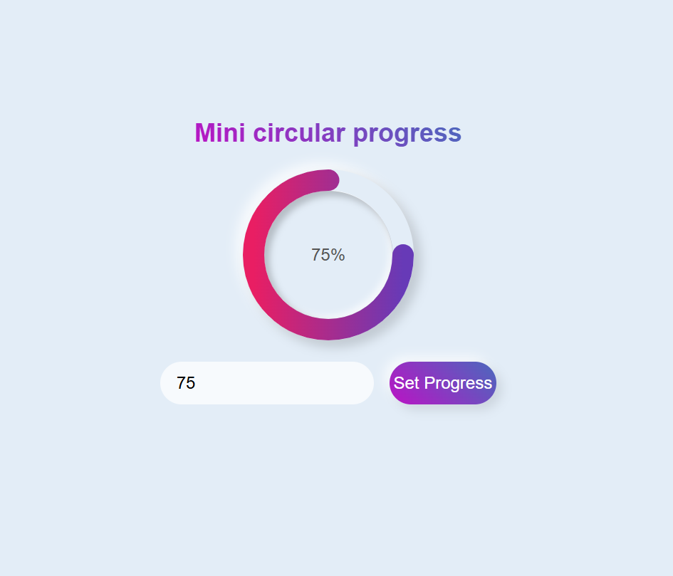

# Circular Progress Bar

Ce projet est une démonstration d'une barre de progression circulaire animée en utilisant HTML, CSS et JavaScript.

## Structure du projet

- [ ] `index.html`: Le fichier HTML principal qui contient la structure de la page.
- [ ] `circular.css`: Le fichier CSS qui contient les styles pour la barre de progression circulaire et d'autres éléments de la page.
- [ ] `readme.md`: Ce fichier, qui contient des informations sur le projet.

## Fonctionnalités

- Affichage d'une barre de progression circulaire avec un pourcentage.
- Animation de la barre de progression en fonction du pourcentage saisi par l'utilisateur.
- Formulaire pour entrer un pourcentage et mettre à jour la barre de progression.

## Utilisation

1. Ouvrez le fichier `index.html` dans un navigateur web.
2. Entrez un pourcentage dans le champ de saisie et cliquez sur le bouton "Set Progress" pour mettre à jour la barre de progression.

## Styles

Les styles pour la barre de progression circulaire et d'autres éléments de la page sont définis dans le fichier `circular.css`.

## Script

Le fichier `index.html` contient un script JavaScript qui gère l'animation de la barre de progression en fonction du pourcentage saisi par l'utilisateur.

Voici donc un aperçu de la page web:

## Auteur

Ce projet est inspiré d'une vidéo youtube dont voici le lien 👍

> <iframe width="560" height="315" src="https://www.youtube.com/embed/mSfsGTIQlxg?si=NN7rc_2_3ruUvl9m" title="YouTube video player" frameborder="0" allow="accelerometer; autoplay; clipboard-write; encrypted-media; gyroscope; picture-in-picture; web-share" referrerpolicy="strict-origin-when-cross-origin" allowfullscreen></iframe>

Ce projet a été créé par Gbessaya-joseph.
